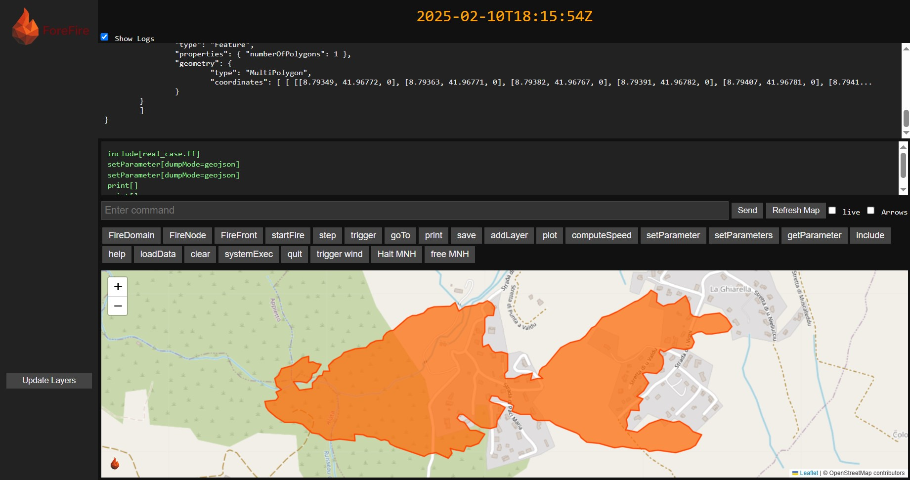

<p align="center">
  
</p>


---
[](https://github.com/forefireAPI/forefire/actions/workflows/main.yml)
[](https://github.com/forefireAPI/forefire/actions/workflows/macos.yml)
[](https://www.gnu.org/licenses/gpl-3.0)


[](https://forefire.readthedocs.io/en/latest/?badge=latest) 
[](https://www.researchgate.net/publication/278769168_ForeFire_open-source_code_for_wildland_fire_spread_models) <!-- Or use Zenodo DOI if available -->


**ForeFire** is an open-source **wildfire simulation engine** written in C++. Developed by CNRS at the [Université de Corse Pascal Paoli](https://www.univ-corse.fr/), it is used for research and operational forecasting. The engine implements various fire behavior models and enables high-fidelity coupled fire-atmosphere simulations, aiming to improve wildfire prediction and understanding for complex environments.


**Key Links:**
- 📚 **Full Documentation:** [forefire.readthedocs.io](https://forefire.readthedocs.io/en/latest/)
- 🚀 **Live Demo:** [forefire.univ-corse.fr/sim](http://forefire.univ-corse.fr/sim)
- 🌍 **Website:** [forefire.univ-corse.fr](https://forefire.univ-corse.fr/)

## Features

*   **Advanced Simulation Engine:** Core C++ logic for fire propagation using various Rate of Spread (ROS) models and handling complex geospatial data (NetCDF).
*   **Fire-Atmosphere Coupling:** Designed for two-way coupling by linking the core library with atmospheric models like [MesoNH](https://mesonh.aero.obs-mip.fr/mesonh/) (developed by CNRS & Météo-France).
*   **High Performance:** Optimized C++ core with MPI support for parallel computing.
*   **Flexible Interfaces:** Built upon a core **C++ Simulation Engine (Library)**:
    *   **`forefire` Interpreter:** The primary way to run simulations using script files (`.ff`), interactive console commands, or the web interface (via `listenHTTP[]`).
    *   **C++ Library (`libforefireL`):** Allows direct integration into other software.
    *   **Python Bindings:** Enable scripting and control from Python (see [./bindings/python/README.md](./bindings/python/README.md)).
*   **Flexible Output:** Can generate outputs in various formats, including KML for visualization in Google Earth, Geojson, NetCDF, and custom binary/text formats.
*   **Extensible:** Add custom ROS models in C++; customize web interfaces.
*   **Applications:** Research, case reanalysis, ensemble forecasting.


## Quick Start with Docker

The easiest way to get started is often using Docker and the interactive console, via the **`forefire` command-line interpreter** 



1. Clone the repository
    
    ``` bash
    # Clone the repository
    git clone https://github.com/forefireAPI/forefire.git
    cd forefire
    ```

2. Build the Docker image 

    ```bash
    docker build . -t forefire:latest
    ```

3. Run the container interactively

    ```bash
    docker run -it --rm -p 8000:8000 --name ff_interactive forefire bash
    ```
4. Inside the container navigate to test directory and lauch the forefire console:
    ```bash
    cd tests/runff

    # start the forefire console with the command
    forefire
    ```

5. Inside the console launch an http server with listenHttp[] command

    ```bash
    forefire> listenHTTP[]

    # the output should be
    >> HTTP command server listening at http://localhost:8000
    ```

    This server provides a grafical user interface that you can access on your browser at http://localhost:8000/

6. Run your first simulation
    - Run the command `include[real_case.ff]`
    - Then press Refresh Map

    You should see a simulation running in the Aullène region of Corsica. **This confirms your Docker setup is working!** Check the full documentation for more details on this example

## Build from source

See the Full Documentation for more details on building from source with the `install-forefire.sh` file

## Python Bindings
ForeFire provides Python bindings for easier scripting and integration. See the Python Bindings [./bindings/python/README.md](./bindings/python/README.md) for details.

## Contributing

We welcome contributions to ForeFire! We especially appreciate help with:

- Improving documentation and tutorials.
- Python bindings
- Enhancing packaging (Docker, Pip, etc.) and cross-platform compatibility.

 Please read our **[Contributing Guidelines](CONTRIBUTING.md)** to learn how you can help, including how to report bugs, suggest features, and submit code changes.

All contributors are expected to adhere to our **[Code of Conduct](CODE_OF_CONDUCT.md)**.


## License
ForeFire is licensed under the GNU General Public License v3.0. See [LICENSE](./LICENSE) for full details.

## Citation
If you use ForeFire in your work, please cite:

**BibTex**
```bibtex
@article{article,
author = {Filippi, Jean-Baptiste and Bosseur, Frédéric and Grandi, Damien},
year = {2014},
month = {11},
pages = {},
title = {ForeFire: open-source code for wildland fire spread models},
isbn = {9789892608846},
doi = {10.14195/978-989-26-0884-6_29}
}
```

**Plain Text**
> Filippi, Jean-Baptiste & Bosseur, Frédéric & Grandi, Damien. (2014). ForeFire: open-source code for wildland fire spread models. 10.14195/978-989-26-0884-6_29. 